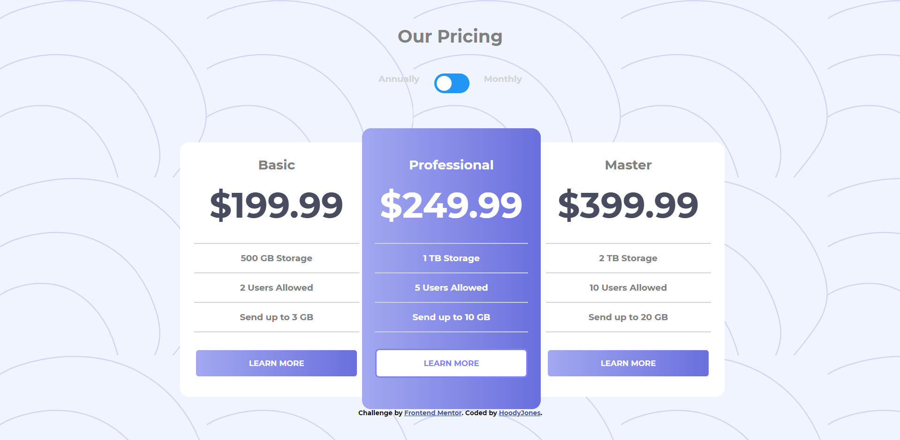

# Pricing component with toggle

## Table of contents

- [Overview](#overview)
- [Screenshot](#screenshot)
- [My process](#my-process)
  - [Built with](#built-with)
  - [What I learned](#what-i-learned)
  - [Useful resources](#useful-resources)

  ## Overview

  This interactive pricing component can be used to showcase three different pricing plans for a nonexistent product. Pricing component can be toggled between showing the prices in either monthly or yearly payment. This project required HTML5, JavaScript and usage of some clever CSS styling, in order to get the toggle mechanic to work properly. The project was also built using React, since I like using it. The application is also completely mobile friendly and can be scaled down to fit a mobile screen. The goal of the project was to build the application to resemble the provided design pictures as much as possible. Project idead came from FrontEndMentor - website.

  ## Screenshot

  

  ## My Process

  ### Built with

  - Semantic HTML5 markup
  - CSS
  - JavaScript
  - [React](https://reactjs.org/) - JS library

  ### What I learned

  I chose this project cause it was something I had not previously done. It also felt like a good mix of HTML, CSS, JavaScript and React. I also wanted to hone my CSS skills and this project proved excellent for that.

  ### Useful resources

  - [Frontend Mentor](https://www.frontendmentor.io/) - Source for great project ideas